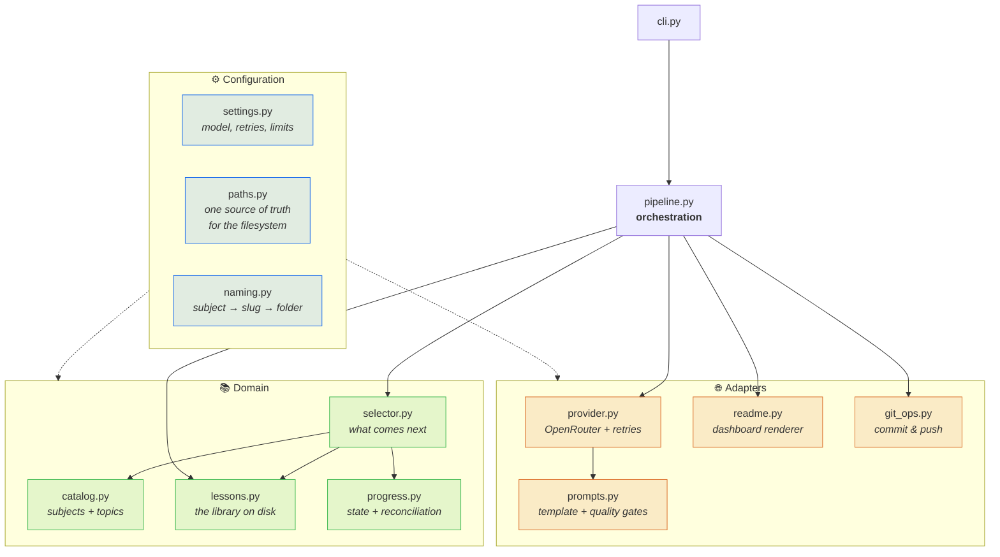
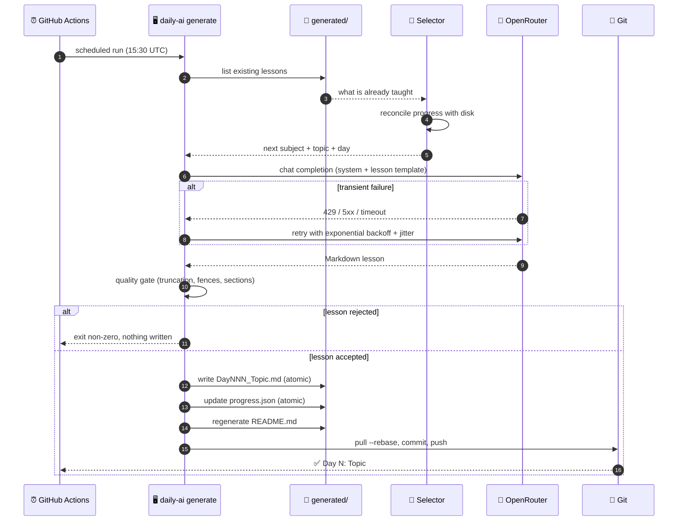

<div align="center">


<a href="https://github.com/Abrarcloudengg/Daily-AI-Learning">
  
</a>

<p>
  <a href="https://github.com/Abrarcloudengg/Daily-AI-Learning/actions/workflows/daily.yml">
    
  </a>
  <a href="https://github.com/Abrarcloudengg/Daily-AI-Learning/actions/workflows/ci.yml">
    
  </a>
  <a href="https://github.com/Abrarcloudengg/Daily-AI-Learning/blob/main/LICENSE">
    
  </a>
  <a href="https://www.python.org/downloads/">
    
  </a>
</p>

<p>
  <a href="https://github.com/Abrarcloudengg/Daily-AI-Learning/stargazers">
    
  </a>
  <a href="https://github.com/Abrarcloudengg/Daily-AI-Learning/commits/main">
    
  </a>
  <a href="https://github.com/Abrarcloudengg/Daily-AI-Learning/issues">
    
  </a>
  
</p>

<p>
  <a href="#-quickstart"><b>Quickstart</b></a> ·
  <a href="#-configuration"><b>Configuration</b></a> ·
  <a href="#-architecture"><b>Architecture</b></a> ·
  <a href="https://abrarcloudengg.github.io/Daily-AI-Learning/"><b>Docs</b></a> ·
  <a href="#-faq"><b>FAQ</b></a>
</p>

</div>

---

## 📖 About

**Daily AI Learning** is a self-driving curriculum. It holds a 740-topic roadmap across
15 subjects, and every day a GitHub Actions job picks up exactly where it left off,
asks a large language model for the next lesson, validates the result, files it under
`generated/`, refreshes this README, and commits — with nobody at the keyboard.

The interesting part is not the API call. It is everything around it:

| Problem an unattended daily job actually has | How this repo solves it |
|---|---|
| State drifts from reality after a bad merge | `generated/` is the source of truth; progress is **reconciled from disk** every run |
| A crash mid-write corrupts the state file | Every JSON write is **atomic** (temp file + `os.replace`) |
| The model truncates a lesson | Responses are **quality-gated** for truncation, unclosed fences, and missing sections |
| The provider rate-limits or times out | **Exponential backoff with jitter**, honouring `Retry-After` |
| Two runs push at once | Push **rebases and retries** instead of failing |
| Two counters disagree about the day number | There is exactly **one** counter, derived from the lesson files |

The result is a repository that keeps working when you forget it exists.

---

## 📊 Live Progress

<div align="center">

`█░░░░░░░░░░░░░░░░░░░░░░░`  **2.84%**

</div>

| | |
|---|---|
| 📚 **Current subject** | Python |
| 🎯 **Current topic** | Recursion |
| 📅 **Next lesson** | Day 22 of Python |
| 📈 **Subject progress** | 21/114 · 18.4% |
| ✅ **Lessons written** | 21/740 |
| 📦 **Subjects finished** | 0/15 |
| 🗂️ **Files on disk** | 21 Markdown lessons |

> This table is regenerated by `daily-ai readme` on every run. Do not edit it by hand —
> your changes will be overwritten on the next lesson.

---

## 🗺️ Roadmap

| # | Subject | Status | Lessons | Progress | Folder |
|---:|---|---|---:|---|---|
| 1 | **Python** | 🚀 In progress | 21/114 | `██░░░░░░░░░░` | [`Python/`](generated/Python) |
| 2 | **Git** | 📘 Queued | 0/40 | `░░░░░░░░░░░░` | [`Git/`](generated/Git) |
| 3 | **SQL** | 📘 Queued | 0/40 | `░░░░░░░░░░░░` | [`SQL/`](generated/SQL) |
| 4 | **Linux** | 📘 Queued | 0/40 | `░░░░░░░░░░░░` | [`Linux/`](generated/Linux) |
| 5 | **AWS** | 📘 Queued | 0/60 | `░░░░░░░░░░░░` | [`AWS/`](generated/AWS) |
| 6 | **Docker** | 📘 Queued | 0/40 | `░░░░░░░░░░░░` | [`Docker/`](generated/Docker) |
| 7 | **Kubernetes** | 📘 Queued | 0/40 | `░░░░░░░░░░░░` | [`Kubernetes/`](generated/Kubernetes) |
| 8 | **HTML** | 📘 Queued | 0/30 | `░░░░░░░░░░░░` | [`HTML/`](generated/HTML) |
| 9 | **CSS** | 📘 Queued | 0/30 | `░░░░░░░░░░░░` | [`CSS/`](generated/CSS) |
| 10 | **JavaScript** | 📘 Queued | 0/60 | `░░░░░░░░░░░░` | [`JavaScript/`](generated/JavaScript) |
| 11 | **React** | 📘 Queued | 0/45 | `░░░░░░░░░░░░` | [`React/`](generated/React) |
| 12 | **Node.js** | 📘 Queued | 0/45 | `░░░░░░░░░░░░` | [`NodeJS/`](generated/NodeJS) |
| 13 | **DSA** | 📘 Queued | 0/66 | `░░░░░░░░░░░░` | [`DSA/`](generated/DSA) |
| 14 | **AI** | 📘 Queued | 0/60 | `░░░░░░░░░░░░` | [`AI/`](generated/AI) |
| 15 | **LangChain** | 📘 Queued | 0/30 | `░░░░░░░░░░░░` | [`LangChain/`](generated/LangChain) |

**Learning flow**

```text
Python → Git → SQL → Linux → AWS → Docker → Kubernetes → HTML → CSS → JavaScript → React → Node.js → DSA → AI → LangChain
```

---

## ✨ Features

**Content**

- 🧠 Beginner → Intermediate → Advanced in a single lesson
- 📐 24 fixed sections per lesson: theory, syntax, three worked examples, output, pitfalls, best practices
- 🎯 10 interview questions, 10 MCQs, 10 practice questions, 5 coding exercises
- 🛠️ A mini project and an assignment in every lesson

**Engineering**

- ♻️ Idempotent — a topic is never generated twice, even if state is lost
- 🔁 Self-healing — progress is rebuilt from the filesystem on every run
- 🛡️ Atomic writes — an interrupted run cannot corrupt state
- 🌐 Resilient networking — retries with jitter, `Retry-After` aware, typed errors
- 🔍 Quality gates — truncated or malformed lessons are rejected, not committed
- 🧪 Tested — pytest suite covering naming, progress, selection, and rendering
- 📋 Real logging — levels, timestamps in CI, UTF-8 safe on Windows
- 🧩 Typed — full type hints, `ruff` + `mypy` clean in CI
- 🖥️ Cross-platform — identical behaviour on Windows, macOS, and Linux

---

## 🏗️ Architecture

Every module has one job and no module reaches around another.



**Design rules**

1. **The filesystem is the database.** `data/progress.json` is a cache and is always
   rebuilt from `generated/` before any decision is made.
2. **Paths are injected, never assumed.** Nothing resolves a path from the current
   working directory, so the tests run against a `tmp_path` workspace.
3. **Failures are typed.** Every deliberate error subclasses `DailyAILearningError`
   and carries a process exit code.
4. **The pipeline decides, the modules execute.** Only `pipeline.py` knows the order
   of operations.

---

## 🔄 How a Run Works



---

## 📂 Project Structure

```text
Daily-AI-Learning/
├── .github/
│   ├── ISSUE_TEMPLATE/          # Bug report + feature request forms
│   └── workflows/
│       ├── daily.yml            # ⏰ The scheduled lesson generator
│       ├── ci.yml               # ✅ Lint, type-check, test on every push
│       ├── pages.yml            # 📄 Publishes docs/ to GitHub Pages
│       └── release.yml          # 🏷️ Tag → GitHub Release
├── config/
│   ├── settings.json            # Model, token budget, retry policy
│   ├── subjects.json            # The roadmap, in teaching order
│   └── topics/                  # One <subject>_topics.json per subject
├── data/
│   └── progress.json            # Generated state (rebuilt from disk if lost)
├── docs/                        # GitHub Pages site
├── generated/                   # 📚 The lessons
│   ├── Python/
│   ├── Git/
│   ├── SQL/
│   ├── Linux/
│   └── … 11 more subjects
├── src/daily_ai_learning/       # 🧠 The package
│   ├── catalog.py               # Subjects and topics
│   ├── cli.py                   # Command line interface
│   ├── git_ops.py               # Commit and push
│   ├── lessons.py               # The lesson library on disk
│   ├── naming.py                # Subject → slug → folder mapping
│   ├── paths.py                 # Workspace layout
│   ├── pipeline.py              # Orchestration
│   ├── progress.py              # State + reconciliation
│   ├── prompts.py               # Lesson template + quality gates
│   ├── provider.py              # OpenRouter client
│   ├── readme.py                # This file's generator
│   ├── selector.py              # What to teach next
│   └── settings.py              # Configuration
├── scripts/                     # Thin shims: legacy `python scripts/generator.py`
└── tests/                       # pytest suite
```

---

## 🚀 Quickstart

> **Requirements** — Python 3.10+, git, and a free [OpenRouter](https://openrouter.ai/keys) API key.

```bash
# 1. Clone
git clone https://github.com/Abrarcloudengg/Daily-AI-Learning.git
cd Daily-AI-Learning

# 2. Create an isolated environment
python -m venv venv
source venv/bin/activate          # Windows: venv\Scripts\activate

# 3. Install
pip install -e .[dev]              # add dev tools for testing, linting, and type checking

# 4. Add your API key
cp .env.example .env              # Windows: copy .env.example .env
#    then edit .env and paste your OpenRouter key

# 5. Check the setup before spending a token
daily-ai doctor

# 6. Generate today's lesson
daily-ai generate
```

**No installation?** The legacy entry point still works:

```bash
pip install -r requirements.txt
python scripts/generator.py
```

### Run it on autopilot

1. Fork or push this repository to GitHub.
2. Go to **Settings → Secrets and variables → Actions → New repository secret**.
3. Name it `OPENROUTER_API_KEY` and paste your key.
4. Open the **Actions** tab and enable workflows.

That is the whole setup. A lesson lands every day at **15:30 UTC (21:00 IST)**, and
you can trigger one immediately from **Actions → Daily Lesson → Run workflow**.

---

## ⚙️ Configuration

Three layers, each overriding the one above it.

**1. `config/settings.json`** — the reviewable defaults:

| Key | Default | What it controls |
|---|---|---|
| `model` | `qwen/qwen3-coder` | Any [OpenRouter model](https://openrouter.ai/models) slug |
| `max_tokens` | `8000` | Response budget. Below ~6000 the template gets truncated |
| `temperature` | `0.7` | Creativity. Lower is more consistent |
| `max_retries` | `3` | Attempts before the run gives up |
| `retry_backoff` | `5.0` | Seconds for the first retry; doubles each time |
| `request_timeout` | `180.0` | Seconds to wait for one response |
| `min_lesson_chars` | `1200` | Shorter responses are treated as truncated |
| `lessons_per_run` | `1` | Lessons generated per invocation |
| `log_level` | `INFO` | `DEBUG`, `INFO`, `WARNING`, `ERROR` |
| `git_remote` / `git_branch` | `origin` / `main` | Push target |

**2. Environment variables** — `DAILY_AI_<KEY>` overrides any of the above for one run:

```bash
DAILY_AI_MODEL=anthropic/claude-sonnet-4 DAILY_AI_LOG_LEVEL=DEBUG daily-ai generate
```

**3. Secrets** — never in a file that git tracks:

| Variable | Where it goes |
|---|---|
| `OPENROUTER_API_KEY` | `.env` locally, an Actions secret in CI |

### Customising the curriculum

Add a subject in three steps:

```jsonc
// 1. config/subjects.json — append it in teaching order
{ "subjects": ["Python", "Git", "Rust"] }
```

```jsonc
// 2. config/topics/rust_topics.json — the file name is the lower-cased,
//    non-alphanumeric-stripped subject name
{ "subject": "Rust", "topics": ["Ownership", "Borrowing", "Lifetimes"] }
```

```bash
# 3. Verify before the scheduler finds the mistake for you
daily-ai validate
```

---

## 🖥️ Usage

```bash
daily-ai generate              # write the next lesson (default: 1)
daily-ai generate --count 5    # catch up on five lessons in one go
daily-ai generate --dry-run    # show what would happen; no API call, no writes
daily-ai generate --no-git     # generate and save, but do not commit or push

daily-ai next                  # which topic is next?
daily-ai status                # full progress dashboard in the terminal
daily-ai readme                # regenerate README.md only (free, no API call)
daily-ai validate              # check every config file for problems
daily-ai doctor                # verify environment, key, git, and config
daily-ai version               # print the version
```

Every command accepts `--log-level DEBUG` for a full trace, and `--root PATH` to run
against a checkout other than the current one.

**Exit codes** are meaningful, so CI can branch on them:

| Code | Meaning |
|---:|---|
| `0` | Success, or nothing left to do |
| `65` | Bad data — a malformed topic file or progress file |
| `69` | The model provider failed after every retry |
| `70` | A lesson was generated but failed the quality gate |
| `78` | Bad configuration — usually a missing API key |
| `130` | Interrupted with Ctrl-C |

---

## 📤 Example Output

```console
$ daily-ai generate
📚 Python · Day 9 · While Loop  (9/114)
Requesting lesson from qwen/qwen3-coder (attempt 1/3)…
Received 21418 characters (finish_reason=stop, tokens=7734).
✅ Quality gate passed: 24/24 sections, 21418 characters.
📝 Wrote generated/Python/Day009_While_Loop.md
📊 Updated README.md
🔀 Committed: Day 9: While Loop (Python)
🚀 Pushed to origin/main

Done in 48.2s.
```

Each generated lesson follows the same 24-section shape:

```markdown
# While Loop

## Learning Objectives
## Prerequisites
## What is While Loop?
## Why is it Important?
## Real World Analogy
## Theory
## Syntax
## Flow / Working
## Example 1 (Beginner)
## Example 2 (Intermediate)
## Example 3 (Advanced)
## Output
## Common Mistakes
## Best Practices
## Pro Tips
## Interview Questions (10)
## MCQs (10)
## Practice Questions (10)
## Coding Exercises (5)
## Mini Project
## Assignment
## Summary
## Key Takeaways
## Next Topic Preview
```

📖 **Read a real one:** [`generated/Python/Day001_Variables.md`](generated/Python/Day001_Variables.md)

---

## 📸 Screenshots

<div align="center">

<!-- Replace these placeholders with real captures: docs/assets/*.png -->

| Terminal run | GitHub Actions |
|---|---|
|  |  |

| A generated lesson | Progress dashboard |
|---|---|
|  |  |

</div>

---

## 🤖 Automation

| Workflow | Trigger | What it does |
|---|---|---|
| [`daily.yml`](https://github.com/Abrarcloudengg/Daily-AI-Learning/blob/main/.github/workflows/daily.yml) | `schedule` 15:30 UTC · manual | Generates the next lesson and commits it |
| [`ci.yml`](https://github.com/Abrarcloudengg/Daily-AI-Learning/blob/main/.github/workflows/ci.yml) | push · pull request | `ruff`, `mypy`, and `pytest` on Linux, macOS, and Windows |
| [`pages.yml`](https://github.com/Abrarcloudengg/Daily-AI-Learning/blob/main/.github/workflows/pages.yml) | push to `main` | Publishes `docs/` to GitHub Pages |
| [`release.yml`](https://github.com/Abrarcloudengg/Daily-AI-Learning/blob/main/.github/workflows/release.yml) | tag `v*` | Builds the package and drafts a GitHub Release |

The daily job runs with `concurrency` enabled, so a manual run and a scheduled run can
never race each other into a merge conflict.

**Manual trigger with options:**

Actions → *Daily Lesson* → *Run workflow* → set `count` (how many lessons) or `dry_run`.

---

## 🧪 Development

```bash
pip install -e ".[dev]"

pytest                       # run the suite
pytest --cov=daily_ai_learning --cov-report=term-missing

ruff check .                 # lint
ruff format .                # format
mypy src                     # type-check
```

The tests never touch the network and never touch your real workspace: `tests/conftest.py`
builds a throwaway repository under `tmp_path` and points `DAILY_AI_ROOT` at it.

---

## 🔭 Roadmap

Ideas that fit the existing architecture, roughly in order of value:

| | Feature | Sketch |
|---|---|---|
| 🧠 | **Spaced repetition** | Schedule revision lessons at 1/3/7/21 days using the day numbers already on disk |
| ❓ | **Quiz generator** | Extract the MCQ section of each lesson into a runnable `quiz` command |
| 🃏 | **Flashcards** | Emit Anki-compatible CSV from *Key Takeaways* |
| 📄 | **PDF export** | Bundle a finished subject into a single typeset PDF |
| 🎓 | **Certificates** | Generate a completion certificate when a subject reaches 100% |
| 📊 | **Analytics** | Streaks, velocity, and time-to-completion charts in the README |
| 🗓️ | **Weekly digest** | Summarise the week's lessons into one recap file |
| 🧩 | **Project generator** | Chain finished topics into an end-of-subject capstone project |
| 🏆 | **Achievements** | Badges for streaks and subject completions |
| 🌍 | **Multi-language** | Generate the same curriculum in another spoken language |
| 🔀 | **Model fallback** | Automatically fall back to a second model when the first is unavailable |
| 🔊 | **Audio lessons** | Text-to-speech version of each lesson for commutes |

Want one of these? [Open an issue](../../issues/new/choose) — or build it and open a PR.

---

## ❓ FAQ

<details>
<summary><b>Does it cost anything to run?</b></summary>

OpenRouter has free-tier models, and the default `qwen/qwen3-coder` is inexpensive.
One lesson is a single request of roughly 8k output tokens. GitHub Actions minutes are
free on public repositories.
</details>

<details>
<summary><b>What happens if a run fails halfway through?</b></summary>

Nothing breaks. A lesson is written only after it passes the quality gate, and every
state write is atomic. On the next run, progress is rebuilt from the files that exist,
so the failed topic is simply attempted again.
</details>

<details>
<summary><b>Can I use a different model?</b></summary>

Yes. Change `model` in `config/settings.json` to any
[OpenRouter model slug](https://openrouter.ai/models), or set `DAILY_AI_MODEL` for a
single run. Nothing else in the codebase is provider-specific.
</details>

<details>
<summary><b>Why is `data/progress.json` committed if it is generated?</b></summary>

So the README dashboard is correct on GitHub without running anything. It is treated as
a cache: if it is lost, corrupted, or mangled by a merge, the next run rebuilds it from
`generated/`. That is what `progress.reconcile()` exists for.
</details>

<details>
<summary><b>Will it ever generate the same lesson twice?</b></summary>

No. Selection asks the filesystem, not the state file. A topic with a
`DayNNN_Topic.md` file is skipped even if `progress.json` has never heard of it.
</details>

<details>
<summary><b>How do I catch up after missing a few days?</b></summary>

`daily-ai generate --count 7`. Lessons are numbered by position, not by calendar date,
so nothing gets out of order.
</details>

<details>
<summary><b>The emoji look like <code>🚀</code> in my terminal. Is the file corrupt?</b></summary>

No — that is PowerShell's legacy console encoding, not the file. Use
`Get-Content README.md -Encoding UTF8`, or run `chcp 65001` once per session. The file
itself is valid UTF-8.
</details>

<details>
<summary><b>Can I add my own subject?</b></summary>

Yes, and it takes two files: append the subject to `config/subjects.json` and add
`config/topics/<slug>_topics.json`. Run `daily-ai validate` to confirm the wiring.
</details>

---

## 🤝 Contributing

Contributions are welcome — new subjects, better prompts, bug fixes, docs.

1. Read [CONTRIBUTING.md](https://github.com/Abrarcloudengg/Daily-AI-Learning/blob/main/CONTRIBUTING.md)
2. Fork, branch, and make your change
3. Run `pytest` and `ruff check .`
4. Open a pull request using the template

Please also read the [Code of Conduct](https://github.com/Abrarcloudengg/Daily-AI-Learning/blob/main/CODE_OF_CONDUCT.md)
and, for anything security-related, [SECURITY.md](https://github.com/Abrarcloudengg/Daily-AI-Learning/blob/main/SECURITY.md).

---

## 📜 License

Released under the [MIT License](https://github.com/Abrarcloudengg/Daily-AI-Learning/blob/main/LICENSE).

The generated lessons are produced by a language model. They are a study aid, not a
substitute for official documentation — verify anything you intend to rely on.

---

## 💙 Credits

Built by **[Abrar Patel](https://github.com/Abrarcloudengg)**.

Standing on: [OpenRouter](https://openrouter.ai) · [GitHub Actions](https://github.com/features/actions) ·
[Requests](https://requests.readthedocs.io) · [Ruff](https://docs.astral.sh/ruff/) ·
[pytest](https://docs.pytest.org) · [Shields.io](https://shields.io) ·
[Mermaid](https://mermaid.js.org)

<div align="center">

**If this project is useful to you, a ⭐ helps others find it.**

<a href="https://github.com/Abrarcloudengg/Daily-AI-Learning/stargazers">
  
</a>

<sub>Every lesson in this repository was written by a machine that never misses a day.</sub>

</div>
