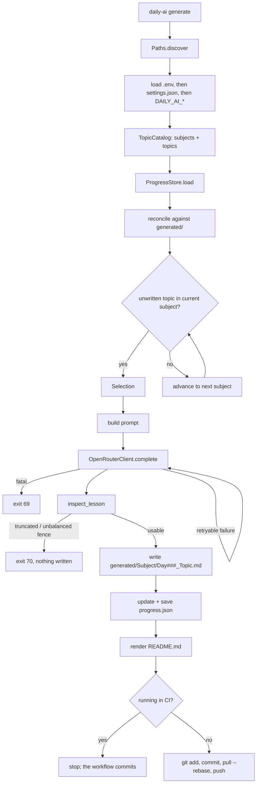

[← Docs home](index.md)

# Architecture

## Layers

Every module depends only on the layer beneath it. Nothing imports upward, so
each one can be tested with nothing but a temporary directory.

```
cli.py                    argv -> command -> exit code
   |
pipeline.py               orchestration: select, generate, inspect, write, commit
   |
   +-- selector.py        which topic is next
   +-- provider.py        HTTP to OpenRouter, retries, redaction
   +-- prompts.py         prompt construction and quality inspection
   +-- readme.py          dashboard rendering
   +-- git_ops.py         subprocess git
   |
   +-- catalog.py         subjects and topics (read-only)
   +-- progress.py        progress record, reconciliation
   +-- lessons.py         files under generated/
   |
   +-- settings.py        configuration
   +-- paths.py           where everything lives
   +-- jsonio.py          atomic read/write
   +-- naming.py          name -> filename mapping
   +-- logging_setup.py   handlers and formatting
   +-- exceptions.py      typed errors and exit codes
```

## Run flow



## Why it is split this way

**`paths.py` exists so tests can run.** In v1 every module built paths relative
to the current directory, which meant the code only worked when invoked from the
repository root and could not be tested without touching the real repository. A
single injected `Paths` object fixed both problems at once.

**`catalog`, `progress`, and `lessons` are three separate readers of three
separate sources.** The curriculum (what *should* exist), the progress record
(what we *think* exists), and the filesystem (what *actually* exists). Keeping
them separate is what makes reconciliation expressible.

**`selector` mutates but never saves.** That is the whole reason `--dry-run` can
be trusted: it runs the real selection logic and leaves no trace.

**`provider` takes an injectable `session` and `sleep`.** The retry tests run in
microseconds against a fake session, with no network and no real sleeping.

**`prompts.inspect_lesson` is pure.** Content in, `QualityReport` out. No I/O, so
every quality rule is a one-line test.

## The reconciliation loop

`data/progress.json` is a cache, not the truth. It is the file most likely to be
corrupted — two runs racing, a merge conflict, a cancelled job — and it is also
the file that decides whether work gets skipped forever.

So on every load:

1. List the files actually present in `generated/<Subject>/`.
2. Rebuild `completed` from those filenames.
3. Anything in the record but not on disk is **dropped** (it will be regenerated).
4. Anything on disk but not in the record is **recovered** (it will not be redone).
5. `day` is not stored at all. It is derived: `len(completed) + 1`.

That last point removed an entire class of bug. v1 kept a separate day counter
that could drift out of sync with the completed list after any interruption, and
once it drifted there was no way to tell which number was right.

## Failure model

| Failure | Behaviour |
| --- | --- |
| Network timeout | Retry with exponential backoff and jitter, up to `max_retries`. |
| HTTP 429 | Retry, honouring `Retry-After` if present. |
| HTTP 401/402/404 | Fail immediately with a specific message. Retrying will not help. |
| Malformed JSON response | Retry — usually a truncated body. |
| Truncated lesson | Reject. Nothing written, nothing marked complete. |
| Crash between write and progress update | The lesson survives; the next run's reconciliation recovers it. |
| Crash mid-write | Impossible to observe: writes are temp-file + `fsync` + `os.replace`. |
| Push rejected | `pull --rebase --autostash`, then retry the push. |
| Ctrl-C | Exit 130. The workspace is left consistent. |

## Naming

`naming.py` is the single place that maps a human name to a filesystem name, so
the generator, the selector, and the reconciler can never disagree about where a
lesson lives.

| Concept | Rule | Example |
| --- | --- | --- |
| Topic file | lowercase, non-alphanumerics stripped | `Node.js` → `config/topics/nodejs_topics.json` |
| Lesson folder | the subject, unless overridden | `Node.js` → `generated/NodeJS/` |
| Lesson file | `Day` + zero-padded day + safe topic | `Day007_Two_Pointer_Technique.md` |

`FOLDER_OVERRIDES` exists because `Node.js`, `C++`, and `C#` are all illegal or
awkward as directory names on Windows.
