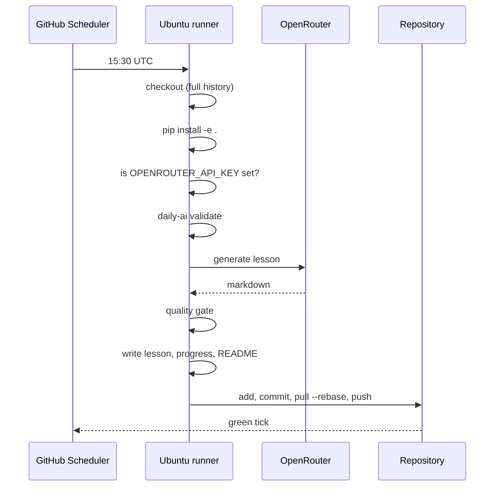

[← Docs home](index.md)

# Automation

Four workflows. Only the first one needs a secret.

| Workflow | Trigger | Does |
| --- | --- | --- |
| `daily.yml` | 15:30 UTC daily, or the Run workflow button | Generates the lesson, commits, pushes |
| `ci.yml` | push to `main`, pull requests | ruff, mypy, pytest on 3.10–3.13 + Windows, offline smoke test |
| `pages.yml` | push touching `docs/` | Publishes this site |
| `release.yml` | pushing a `v*` tag | Builds distributions, opens a GitHub Release |

## Daily Lesson



### Setup

1. **Settings → Secrets and variables → Actions → New repository secret**
   named `OPENROUTER_API_KEY`.
2. **Settings → Actions → General → Workflow permissions →** *Read and write
   permissions*.
3. **Actions → Daily Lesson → Run workflow** to prove it works before waiting a
   day.

A local `.env` does not travel to GitHub. These are two independent places to
put the key, and forgetting the second one is the single most common reason a
fork's automation never runs.

### Design decisions

**The key check runs before anything expensive.** A missing secret fails in ten
seconds with a message naming the exact settings page, instead of three minutes
later with a 401.

**`concurrency: cancel-in-progress: false`.** A cancelled run can leave a lesson
on disk with no matching commit. Queueing is slower and correct.

**`--no-git` in the generate step.** The workflow owns committing. In v1 both the
pipeline and the workflow committed, producing two commits per lesson.

**`git add generated data/progress.json README.md`, not `git add -A`.** Explicit
paths cannot accidentally commit build output or a stray `.env`.

**The push retries three times behind a rebase.** A scheduled run and a manual
push can collide; one retry is not always enough.

### Manual runs

The **Run workflow** button takes two inputs:

- `count` — how many lessons to generate in one go, for catching up.
- `dry_run` — select the next topic and print it, write nothing, commit nothing.

### Changing the time

`cron: "30 15 * * *"` is UTC. GitHub does not do timezones.

| Local time | Cron (UTC) |
| --- | --- |
| 21:00 IST | `30 15 * * *` |
| 09:00 IST | `30 3 * * *` |
| 08:00 UTC | `0 8 * * *` |
| 18:00 EST | `0 23 * * *` |

Scheduled workflows on GitHub are best-effort and often run late under load.
Being an hour late does not matter for a daily lesson.

## CI

Three jobs:

- **lint** — `ruff check`, `ruff format --check`, `mypy src`.
- **test** — pytest with coverage on Python 3.10, 3.11, 3.12, 3.13, plus one
  Windows 3.12 leg. Windows is there specifically to exercise the path handling
  and the console-encoding code, which are the two things that only break there.
- **smoke** — installs the package and runs `validate`, `doctor`, `next`,
  `generate --dry-run`, `readme`, and the legacy `scripts/` entry points, all
  **without an API key**. If any of them starts demanding one, that is a
  regression.

The smoke job also fails if `daily-ai readme` produces a diff — the README is
generated output and must be reproducible from the committed state.

## Pages

Requires a one-time setting: **Settings → Pages → Build and deployment →
Source: GitHub Actions**. Without it the deploy step fails with a 404.

The workflow copies `docs/` plus `README.md` into the artifact so the site and
the repository front page never disagree.

## Release

```bash
# bump version in pyproject.toml and src/daily_ai_learning/__init__.py
# add the section to CHANGELOG.md
git tag -a v2.1.0 -m "v2.1.0"
git push origin v2.1.0
```

The workflow refuses to publish if the tag disagrees with the version in
`pyproject.toml` — that mismatch is how a project ends up with two different
artifacts both claiming to be `2.0.0`. It then builds an sdist and a wheel, runs
`twine check`, extracts the matching `CHANGELOG.md` section as the release body,
and attaches the distributions.

`v2.1.0-rc1` is marked as a prerelease automatically.

## Cost

The default model, `qwen/qwen3-coder`, has a free tier on OpenRouter. One
8000-token lesson a day sits comfortably inside it. GitHub Actions minutes are
free for public repositories, and a run takes roughly two minutes.
